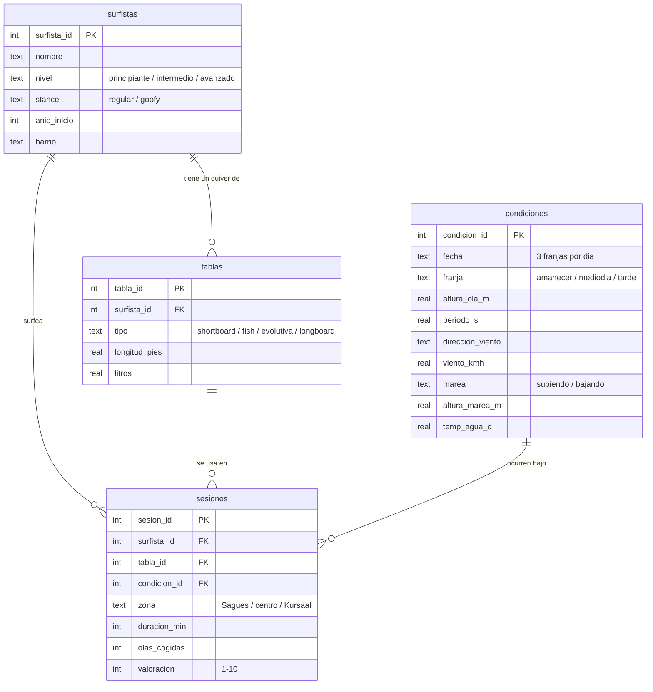

# 🌊 Surf en la Zurriola — proyecto SQL

Base de datos SQLite que modela **un año de surf en la playa de la Zurriola** (Donostia / San Sebastián): las condiciones del mar en cada franja del día, los surfistas habituales con sus tablas, y casi 5.000 sesiones de surf repartidas entre los picos de Sagüés, el centro y el lado del Kursaal.

El objetivo del proyecto es demostrar diseño relacional y SQL analítico sobre un dominio que conozco: joins múltiples, CTEs, funciones de ventana, gaps & islands, pivotes con agregación condicional, vistas e integridad referencial.

## Modelo de datos



Además del esquema hay una vista (`v_sesiones`) que desnormaliza los joins habituales, restricciones `CHECK` en todas las columnas con dominio cerrado, claves foráneas e índices sobre las columnas de búsqueda frecuente.

## Los datos

Los datos son sintéticos pero están generados con lógica realista ([`tools/generar_datos.py`](tools/generar_datos.py)):

- **Estacionalidad cantábrica**: mar grande en otoño-invierno (media de 2,2 m en enero), verano flojo (0,6 m en agosto); agua de 12 °C en invierno a 21 °C en verano.
- **El viento manda**: en la Zurriola el viento de componente sur es *offshore* (ordena el mar) y el norte *onshore* (lo destroza), y las valoraciones de las sesiones lo reflejan.
- **Comportamiento humano**: los principiantes no se meten los días grandes, entre semana a mediodía surfea poca gente, y cuanto mejores son las condiciones más gente hay en el agua.

| tabla | filas |
|---|---|
| surfistas | 15 |
| tablas | 27 |
| condiciones | 1.095 (365 días × 3 franjas) |
| sesiones | ~4.900 |

## Cómo ejecutarlo

Solo hace falta `sqlite3` (viene instalado en macOS y en la mayoría de Linux):

```bash
sqlite3 zurriola.db < schema.sql   # crea el esquema
sqlite3 zurriola.db < seed.sql     # carga el año de datos

# ejecutar cualquier consulta:
sqlite3 -column -header zurriola.db < queries/01_mejores_dias.sql
```

Para regenerar los datos desde cero: `python3 tools/generar_datos.py > seed.sql`.

## Consultas analíticas

Cada archivo de [`queries/`](queries/) responde una pregunta real y demuestra técnicas concretas:

| # | Pregunta | Técnicas SQL |
|---|---|---|
| [01](queries/01_mejores_dias.sql) | ¿Cuáles fueron los 10 mejores días del año? | JOIN, GROUP BY, HAVING |
| [02](queries/02_ranking_surfistas.sql) | Ranking de olas/hora por nivel | CTE, `RANK() OVER (PARTITION BY …)` |
| [03](queries/03_condiciones_ideales.sql) | ¿Qué combinación de ola y viento funciona mejor? | pivote con agregación condicional (`CASE` dentro de `AVG`) |
| [04](queries/04_rachas.sql) | La racha más larga de días seguidos surfeando | gaps & islands, `ROW_NUMBER()`, `julianday()` |
| [05](queries/05_progresion_mensual.sql) | ¿Progresan los principiantes mes a mes? | `LAG()`, media móvil con `ROWS BETWEEN`, cláusula `WINDOW` |
| [06](queries/06_zonas_y_mareas.sql) | ¿Qué zona del pico funciona con cada marea? | discretización con `CASE`, GROUP BY multidimensional |
| [07](queries/07_uso_del_quiver.sql) | ¿Usa la gente cada tabla para lo que toca? | subconsulta correlada, JOIN de 4 tablas |
| [08](queries/08_dias_desaprovechados.sql) | Días buenos en los que casi nadie surfeó | LEFT JOIN + agregado anulable + HAVING |

### Algunos resultados

**Los 10 mejores días del año** (query 01) — todos con viento sur y ola de 1,2-1,6 m:

```
fecha       sesiones  valoracion_media  ola_m  periodo_s  viento
----------  --------  ----------------  -----  ---------  ------
2025-10-20  18        8.67              1.3    10.9       S
2025-10-08  16        8.56              1.19   8.4        S
2026-03-27  19        8.47              1.25   11.3       S
```

**Ola × viento** (query 03) — el offshore mejora la valoración en todos los tamaños, y el punto dulce es el mar entre 0,8 y 2,2 m:

```
tamano                offshore  lateral  onshore  sesiones
--------------------  --------  -------  -------  --------
1. pequeño (<0.8 m)   5.81      4.92     4.97     854
2. medio (0.8-1.5 m)  7.71      6.93     6.65     2096
3. bueno (1.5-2.2 m)  7.62      7.1      6.84     1535
4. grande (>2.2 m)    6.24      5.76     5.33     412
```

**Zona × marea** (query 06) — las tres zonas rinden mejor a media marea, y Sagüés es donde más olas se cogen:

```
zona     tramo_marea  sesiones  valoracion_media  olas_media
-------  -----------  --------  ----------------  ----------
Sagüés   baja         502       6.55              13.0
Sagüés   media        785       7.02              14.1
Sagüés   alta         733       6.61              13.2
```

## Estructura del repo

```
├── schema.sql            # DDL: tablas, restricciones, índices y vista
├── seed.sql              # un año de datos (generado)
├── queries/              # 8 consultas analíticas comentadas
└── tools/
    └── generar_datos.py  # generador de datos sintéticos realistas
```
