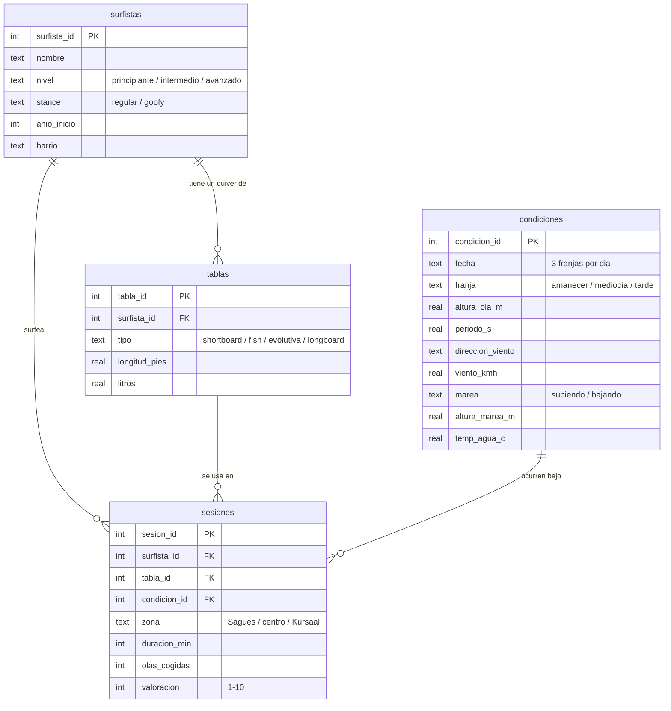

# 🌊 SurfQL — un año de surf en la Zurriola, en SQL

Base de datos SQLite que modela **un año de surf en la playa de la Zurriola** (Donostia / San Sebastián): las **condiciones reales del mar** (oleaje, viento, marea y temperatura del agua, descargadas de la API abierta de Open-Meteo), los surfistas habituales con sus tablas, y casi 5.000 sesiones de surf simuladas sobre esas condiciones, repartidas entre los picos de Sagüés, el centro y el lado del Kursaal.

El objetivo del proyecto es demostrar diseño relacional y SQL analítico sobre un dominio que conozco: joins múltiples, CTEs, funciones de ventana, gaps & islands, pivotes con agregación condicional, vistas e integridad referencial.

## Modelo de datos



Además del esquema hay una vista (`v_sesiones`) que desnormaliza los joins habituales, restricciones `CHECK` en todas las columnas con dominio cerrado, claves foráneas e índices sobre las columnas de búsqueda frecuente.

## Los datos

**Las condiciones del mar son reales.** [`tools/descargar_condiciones.py`](tools/descargar_condiciones.py) las descarga de las APIs abiertas de [Open-Meteo](https://open-meteo.com/) (sin API key) para las coordenadas de la Zurriola, de julio de 2025 a junio de 2026:

- **Marine API**: altura y periodo de ola, temperatura del agua y altura del mar (de la que se deduce si la marea sube o baja).
- **Archive API**: velocidad y dirección del viento a 10 m.

De las series horarias se extraen tres franjas al día (amanecer, mediodía y tarde) y se guardan en [`datos/condiciones_reales.csv`](datos/condiciones_reales.csv). Ahí está el año real del Cantábrico: temporales de invierno de hasta 4,4 m, veranos de 0,9 m de media y agua de 13 °C en febrero a 23 °C en agosto.

**Las sesiones son simuladas** (no existe un registro de quién se mete al agua), pero [`tools/generar_datos.py`](tools/generar_datos.py) las genera sobre las condiciones reales con lógica plausible: en la Zurriola el viento de componente sur es *offshore* (ordena el mar) y el norte *onshore* (lo destroza), los principiantes no se meten los días grandes, entre semana a mediodía surfea poca gente, y cuanto mejores son las condiciones más gente hay en el agua y mejores valoraciones dan.

| tabla | filas | origen |
|---|---|---|
| surfistas | 15 | ficticios |
| tablas | 27 | ficticias |
| condiciones | 1.095 (365 días × 3 franjas) | **reales (Open-Meteo)** |
| sesiones | ~5.000 | simuladas sobre las condiciones reales |

## Cómo ejecutarlo

Solo hace falta `sqlite3` (viene instalado en macOS y en la mayoría de Linux):

```bash
sqlite3 zurriola.db < schema.sql   # crea el esquema
sqlite3 zurriola.db < seed.sql     # carga el año de datos

# ejecutar cualquier consulta:
sqlite3 -column -header zurriola.db < queries/01_mejores_dias.sql
```

Para regenerar los datos desde cero (por ejemplo con otro rango de fechas):

```bash
python3 tools/descargar_condiciones.py        # baja las condiciones reales de Open-Meteo
python3 tools/generar_datos.py > seed.sql     # condiciones reales + sesiones simuladas
```

## Consultas analíticas

Cada archivo de [`queries/`](queries/) responde una pregunta real y demuestra técnicas concretas:

| # | Pregunta | Técnicas SQL |
|---|---|---|
| [01](queries/01_mejores_dias.sql) | ¿Cuáles fueron los 10 mejores días del año? | JOIN, GROUP BY, HAVING |
| [02](queries/02_ranking_surfistas.sql) | Ranking de olas/hora por nivel | CTE, `RANK() OVER (PARTITION BY …)` |
| [03](queries/03_condiciones_ideales.sql) | ¿Qué combinación de ola y viento funciona mejor? | pivote con agregación condicional (`CASE` dentro de `AVG`) |
| [04](queries/04_rachas.sql) | La racha más larga de días seguidos surfeando | gaps & islands, `ROW_NUMBER()`, `julianday()` |
| [05](queries/05_progresion_mensual.sql) | ¿Progresan los principiantes mes a mes? | `LAG()`, media móvil con `ROWS BETWEEN`, cláusula `WINDOW` |
| [06](queries/06_zonas_y_mareas.sql) | ¿Qué zona del pico funciona con cada marea? | discretización con `CASE`, GROUP BY multidimensional |
| [07](queries/07_uso_del_quiver.sql) | ¿Usa la gente cada tabla para lo que toca? | subconsulta correlada, JOIN de 4 tablas |
| [08](queries/08_dias_desaprovechados.sql) | Días buenos en los que casi nadie surfeó | LEFT JOIN + agregado anulable + HAVING |

### Algunos resultados

**Los mejores días del año** (query 01) — con condiciones reales, ganan los otoños e inviernos con mar de fondo y viento sur; el mejor día del año fue el 9 de noviembre de 2025 (1,5 m, 13 s de periodo, sureste):

```
fecha       sesiones  valoracion_media  ola_m  periodo_s  viento
----------  --------  ----------------  -----  ---------  ------
2025-11-09  28        8.86              1.47   13.1       SE
2025-12-11  19        8.74              1.44   12.4       S
2025-11-10  18        8.67              1.47   13.2       SO
```

**Ola × viento** (query 03) — el offshore mejora la valoración en todos los tamaños, y el punto dulce es el mar entre 0,8 y 2,2 m:

```
tamano                offshore  lateral  onshore  sesiones
--------------------  --------  -------  -------  --------
1. pequeño (<0.8 m)   6.29      5.55     5.16     1397
2. medio (0.8-1.5 m)  8.04      7.09     6.76     1982
3. bueno (1.5-2.2 m)  7.85      7.05     6.87     1246
4. grande (>2.2 m)    6.38      5.19     5.14     369
```

**Zona × marea** (query 06) — Sagüés es donde más olas se cogen, y la media marea es la que mejor funciona:

```
zona     tramo_marea  sesiones  valoracion_media  olas_media
-------  -----------  --------  ----------------  ----------
Sagüés   baja         535       6.67              13.7
Sagüés   media        902       6.76              14.0
Sagüés   alta         609       6.79              13.7
```

## Estructura del repo

```
├── schema.sql                    # DDL: tablas, restricciones, índices y vista
├── seed.sql                      # un año de datos (generado)
├── queries/                      # 8 consultas analíticas comentadas
├── datos/
│   └── condiciones_reales.csv    # condiciones reales descargadas de Open-Meteo
└── tools/
    ├── descargar_condiciones.py  # descarga las condiciones reales (Open-Meteo)
    └── generar_datos.py          # simula las sesiones sobre las condiciones reales
```
